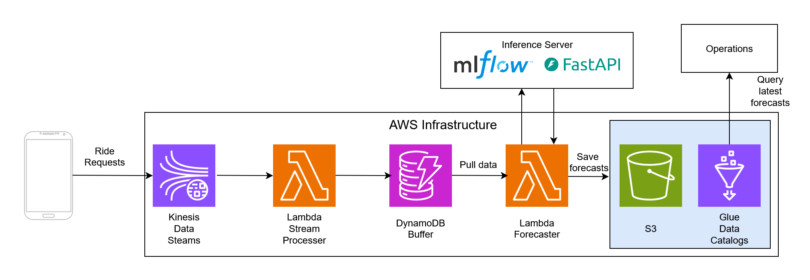

## Overview
ML system using spatio-temporal patterns to forecast Uber/Lyft ride demand for Chicagos different community areas. The data is downloaded from https://data.cityofchicago.org/ and contains 150 million samples. To processes this enourmous amount of data,
Apache Spark was initially used for initial exploration on Databricks community edition while majority of exploration was done locally using duckdb. This data was aggregated to 30 minute intervals so that we can forecast ride demand for the next 30 minutes. Additional weather data was also gathered, but it was only on the hourly interval. Due to the hourly interval, the weather data had to be lagged carefully to avoid data leakage when joining with the rides data. Models were tested using statsmodels Poisson regression, sktime autoarmima, Meta/Facebook Prophet, spreg fixed effects spatial lag model, and PyTorch Geometric Temporal. A Spatio-Temporal Graph Convolutional Network model architecture was chosen due to significantly lower  mean squared error on the validation set.
Feature transforms such as logging, differeencing, and cyclical transforms, were tested to try to improve performance. The models and performance were tracked using MLflow, with the final PyTorch Geometric Temporal model being wrapped in an MLflow PythonModel for easy model serving. With the model, the rest of the system design was layed out on AWS:

## System Architecture 

## MLflow Inference Server
run: `mlflow models serve -m runs:/<run_id>/model -p 5000`
