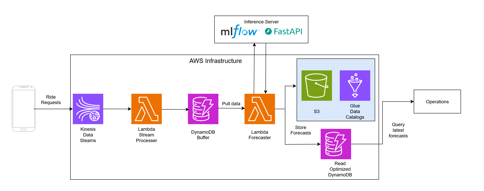

## Overview
ML system using spatio-temporal patterns to forecast Uber/Lyft ride demand for Chicagos different community areas. The data is downloaded from https://data.cityofchicago.org/ and contains 150 million samples. To processes this enourmous amount of data,
Apache Spark was initially used for initial exploration on Databricks community edition while majority of exploration was done locally using duckdb. This data was aggregated to 30 minute intervals so that we can forecast ride demand for the next 30 minutes. Additional weather data was also gathered, but it was only on the hourly interval. Due to the hourly interval, the weather data had to be lagged carefully to avoid data leakage when joining with the rides data. Models were tested using statsmodels Poisson regression, sktime autoarmima, Meta/Facebook Prophet, spreg fixed effects spatial lag model, and PyTorch Geometric Temporal. A Spatio-Temporal Graph Convolutional Network model architecture was chosen due to significantly lower  mean squared error on the validation set.
Feature transforms such as logging, differeencing, and cyclical transforms, were tested to try to improve performance. The models and performance were tracked using MLflow, with the final PyTorch Geometric Temporal model being wrapped in an MLflow PythonModel for easy model serving. With the model, the rest of the system design was layed out on AWS:

## Data processing
Using duckdb, additional datetime features were generated such as pickup hour, pickup month, pickup day of week, etc.
The data is then aggregated into 30 minute bins by goruping by pick_up_community_area, and 30 minute time buckets. This was done using duckdb and SQL. 
The variable of interest that we are modelling is the number of trip_ids observed in the 30 minute interval. This variable is named 'num_rides'. We want to predict the num_rides in the next 30 minutes so we shift num_rides upward with pd.Series.shift(-1) and call the new variable 'target'. Before joining with the weather data, we make sure the 'time' columns is an numpy datetime64[ns] column. Since the ride data is on a 30 minute interval and the weather data on hourly, we must be cautious about joining these datasets due to data leakage. E.g. Say we leave the data as is. If we have are forecasting the next 30 minutes of rides, we will be using the entire hours weather info but we have not observed the entire hour yet at the time of prediction, spawning data leakage. To address this, the weather data is simply lagged backwards. The rides data is left joined on weather. This created some NANs due to different time intervals so they were forward filled. Next we preserve the cyclical nature of hour of the day and day of the week by using sin and cos functions to encode the the cycles. log(x+1) transforms were applied to average_fare and average_trip_total since their underlying distributions looked log-normal or gamma distributed. Some differencing/seasonal differencing was employed to non-stationary features to see if performance would improve. With the final transformations, the data is split into train-validation-test for modelling. The final feature set is:

| #  | Column                          | Non-Null Count | Data Type       |
| -- | ------------------------------- | -------------- | --------------- |
| 0  | pickup\_community\_area         | 3,686,939      | int32           |
| 1  | interval                        | 3,686,939      | datetime64\[us] |
| 2  | num\_rides                      | 3,686,939      | int64           |
| 3  | average\_fare                   | 3,686,939      | float64         |
| 4  | average\_trip\_total            | 3,686,939      | float64         |
| 5  | target                          | 3,686,939      | float64         |
| 6  | temp                            | 3,686,939      | float64         |
| 7  | dwpt                            | 3,686,939      | float64         |
| 8  | rhum                            | 3,686,939      | float64         |
| 9  | prcp                            | 3,686,939      | float64         |
| 10 | wdir                            | 3,686,939      | float64         |
| 11 | wspd                            | 3,686,939      | float64         |
| 12 | pres                            | 3,686,939      | float64         |
| 13 | coco                            | 3,686,939      | float64         |
| 14 | trip\_start\_hour\_sin          | 3,686,939      | float64         |
| 15 | trip\_start\_hour\_cos          | 3,686,939      | float64         |
| 16 | trip\_start\_day\_of\_week\_sin | 3,686,939      | float64         |
| 17 | trip\_start\_day\_of\_week\_cos | 3,686,939      | float64         |
| 18 | num\_rides\_lag1                | 3,686,939      | float64         |
| 19 | num\_rides\_lag2                | 3,686,939      | float64         |
| 20 | num\_rides\_lag3                | 3,686,939      | float64         |
| 21 | num\_rides\_lag4                | 3,686,939      | float64         |
| 22 | num\_rides\_lag5                | 3,686,939      | float64         |
| 23 | num\_rides\_lag6                | 3,686,939      | float64         |
| 24 | num\_rides\_lag7                | 3,686,939      | float64         |
| 25 | num\_rides\_lag8                | 3,686,939      | float64         |
| 26 | num\_rides\_lag9                | 3,686,939      | float64         |
| 27 | temp\_diff                      | 3,686,939      | float64         |
| 28 | average\_fare\_diff             | 3,686,939      | float64         |
| 29 | average\_trip\_total\_diff      | 3,686,939      | float64         |
| 30 | dwpt\_diff                      | 3,686,939      | float64         |
| 31 | fare\_LT                        | 3,686,939      | float64         |
| 32 | trip\_total\_LT                 | 3,686,939      | float64         |

## Feature Selection
SHAP with a XGBoost regressor explainer was used to generate SHAP values. Studying the SHAP values for a random selection of communities showed that num_rides, trip_start_hour_cos, trip_start_hour_sin, average_fare, average_trip_total, trip_start_day_of_week_cos, trip_start_day_of_week_sin, temp, dwpt, pres were likely to be the top 10 features.

## Modelling,
 Single variate models were first trained on each community areas while not expoiting spatial information to get a baseline.
 These models were Prophet, Possion regression, and ARIMA. Since developing each model for each individual community area would be time consuming, autoarima was used to select parameters for ARIMA. After a spatial weight matrix based on community adjacacy and distance was created. This matrix is then used for the spatialAR and the Spatio-Temporal Graph Convolutional Network. The estimation for the spatialAR was challenging due to have having large data causing RAM usage issues (probably due to large matricies), so train data had to be limited to 1000 to 5000 samples per community. This automatically hinders the model as it will not learn patterns for each month or year. For a Spatio-Temporal Graph Convolutional Network (STGCN), the input data should be formatted as graph time series data with shape (n_time_steps, n_lags + 1, n_nodes, n_features), where n_time_steps is the number of time points, n_lags + 1 represents the current timestep plus lagged timesteps, n_nodes is the number of graph nodes, and n_features is the number of features per node. This structure allows the network to leverage not only the lagged values of a node’s neighbors but also the lagged features of those neighbors, without excessively increasing the feature dimension. A softplus ativation was appended at the end of the STGCN model to ensure positive outputs. The STGCN model is trained with a batch-size of 64, AdamW optimizer, learning rate of 0.001, weight decay of 0.0001, and 40 epochs. 
 
All models were assesed with mean-squared error on the validation set. STGCN was by far the most performant with a MSE of 725.78 while Prophet was the second most performant with MSE of 881.78. The others were well above 3000 MSE.
## System Architecture 

## MLflow Inference Server
run: `mlflow models serve -m runs:/<run_id>/model -p 5000 --env-manager <env-manager>`

## Reference:
Bing Yu, Haoteng Yin, Zhanxing Zhu. *Spatio-Temporal Graph Convolutional Networks: A Deep Learning Framework for Traffic Forecasting*. Peking University, 2018. [arXiv:1709.04875](https://arxiv.org/abs/1709.04875)

